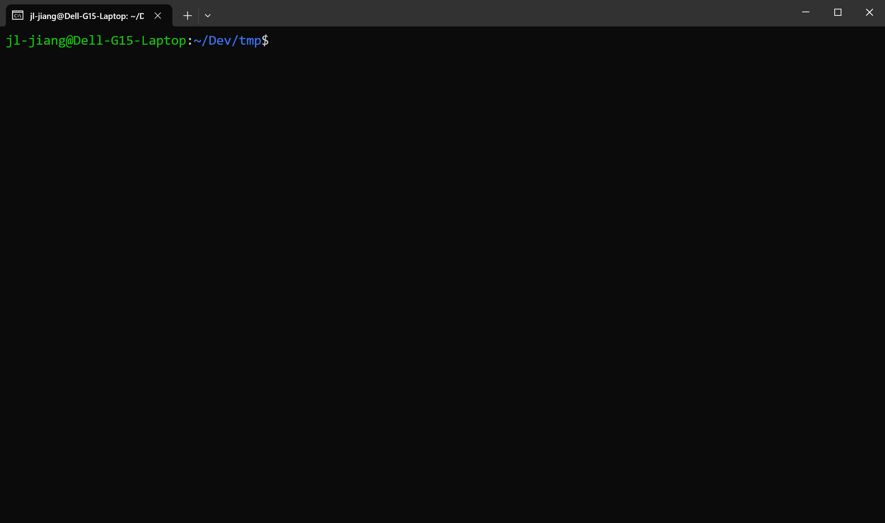

# cargo-buckal

Seamlessly build Cargo packages with Buck2.



## Install

```
cargo install --git https://github.com/buck2hub/cargo-buckal.git
```

## Usage

```
Usage: cargo buckal <COMMAND>

Commands:
  build  Compile the current package
  init   Create a new package in an existing directory
  new    Create a new package
  clean  Clean up the buck-out directory
  add    Add dependencies to a manifest file
  help   Print this message or the help of the given subcommand(s)

Options:
  -h, --help  Print help
```

## Configuration

You can configure cargo-buckal by creating a configuration file at `~/.config/buckal/config.toml`.

### Custom Buck2 Binary Path

If you have buck2 installed in a custom location, you can specify the path:

```toml
buck2_binary = "/path/to/your/buck2"
```

If no configuration file exists, cargo-buckal will use `buck2` (searches your PATH).
